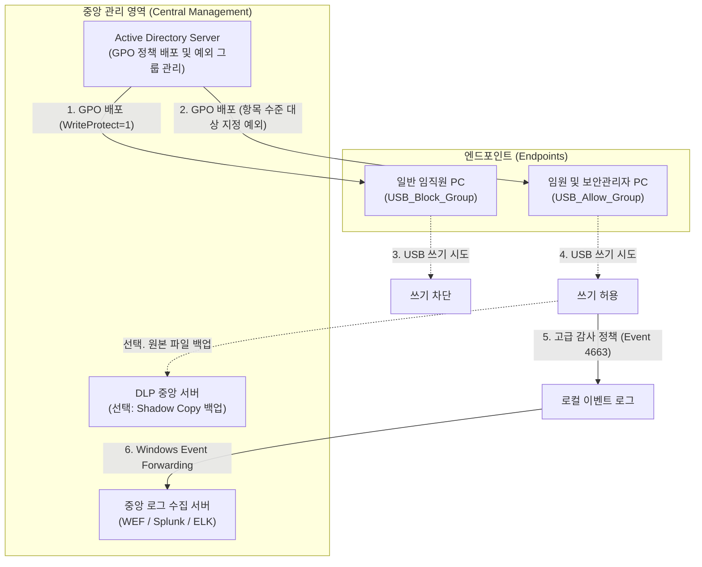
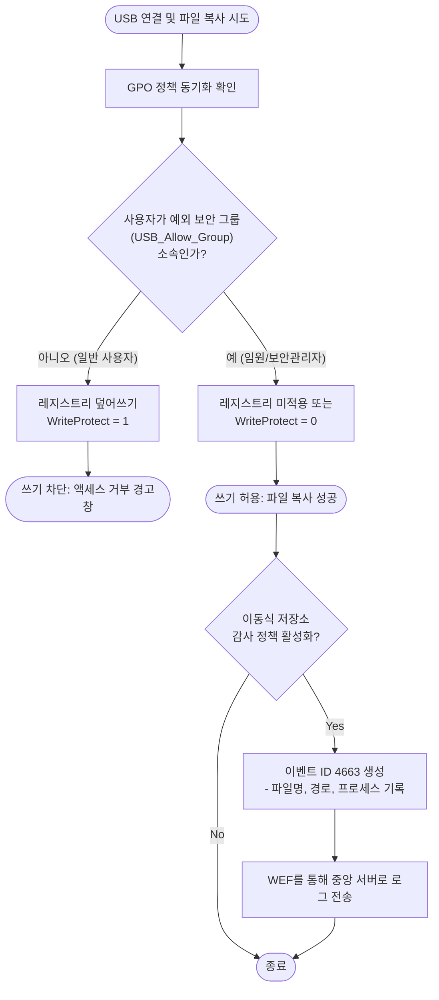

# 사내 USB 매체 제어 및 감사 시스템 아키텍처

본 문서는 사내 정보 유출 방지를 위한 USB 저장 매체(이동식 디스크) 쓰기 제어 정책의 배포, 예외 처리, 그리고 감사(로깅) 추적에 대한 전체 시스템 아키텍처 및 구현 가이드입니다.

---

## 1. 전체 시스템 아키텍처 (System Architecture)

Active Directory(AD)를 중심으로 정책을 배포하고, 예외 사용자의 행위를 중앙에서 모니터링하는 구조입니다.



---

## 2. 정책 적용 및 예외 처리 흐름도 (Logical Flowchart)

사용자가 PC에 USB를 연결하고 파일을 복사(쓰기)하려고 할 때, 시스템 내부에서 정책이 평가되고 로깅되는 논리적 흐름입니다.



---

## 3. 구현 상세 (Implementation Details)

### 3.1. 레지스트리 기반 쓰기 제어 (로컬/단일 PC 용)
AD 환경이 아니거나, 단일 PC에서 정책을 즉시 테스트하기 위한 PowerShell 스크립트입니다. 관리자 권한으로 실행해야 합니다.

```powershell
<#
.SYNOPSIS
  Windows USB 쓰기 금지 정책 적용 스크립트
.DESCRIPTION
  StorageDevicePolicies 레지스트리 키를 생성하고 WriteProtect 값을 1로 설정하여
  USB 등 이동식 저장 장치로의 파일 복사를 원천 차단합니다.
#>

# 1. 레지스트리 키 경로 지정
$RegPath = "HKLM:\SYSTEM\CurrentControlSet\Control\StorageDevicePolicies"

# 2. 해당 경로(StorageDevicePolicies)가 없으면 강제 생성
If (!(Test-Path $RegPath)) {
    Write-Verbose "StorageDevicePolicies 키가 존재하지 않아 새로 생성합니다."
    New-Item -Path "HKLM:\SYSTEM\CurrentControlSet\Control" -Name "StorageDevicePolicies" -Force | Out-Null
}

# 3. WriteProtect 값을 1로 설정 (쓰기 금지)
# ※ 허용으로 되돌리려면 -Value 0 으로 변경하거나 해당 항목을 삭제하면 됩니다.
Set-ItemProperty -Path $RegPath -Name "WriteProtect" -Value 1 -Type DWord

Write-Host "[성공] USB 쓰기 금지 정책이 적용되었습니다. 시스템에 따라 재부팅이 필요할 수 있습니다." -ForegroundColor Green
```

### 3.2. AD GPO 구성 값 (전사 배포 용)
* **경로:** `컴퓨터 구성` > `기본 설정` > `Windows 설정` > `레지스트리`
* **작업:** 업데이트 (Update)
* **하이브:** `HKEY_LOCAL_MACHINE`
* **키 경로:** `SYSTEM\CurrentControlSet\Control\StorageDevicePolicies`
* **값 이름:** `WriteProtect`
* **값 종류:** `REG_DWORD`
* **값 데이터:** `1`

### 3.3. 예외 처리 구성 (GPP 항목 수준 대상 지정)
* **설정 위치:** GPO 레지스트리 속성 창의 `[공통]` 탭 -> `[항목 수준 대상 지정]`
* **조건문:** `사용자가 <Domain\USB_Allow_Group> 보안 그룹의 멤버가 아님 (Is Not)`
* **효과:** 해당 그룹에 속한 사용자가 로그인한 PC에는 `WriteProtect=1` 값이 적용되지 않음.

---

## 4. 감사 및 모니터링 (Auditing & Monitoring)

예외 그룹(임원, 보안관리자)의 무분별한 반출을 방지하기 위해 로깅을 의무화합니다.

1. **감사 정책 활성화 (GPO):**
   * 경로: `컴퓨터 구성` > `정책` > `Windows 설정` > `보안 설정` > `고급 감사 정책 구성` > `개체 액세스` > `이동식 저장소 감사`
   * 설정: **성공(Success)** 선택
2. **이벤트 추적 (Event ID 4663):**
   * 기록 위치: 로컬 이벤트 뷰어 (보안 로그)
   * 기록 내용: 누가, 언제, 어떤 파일(파일명 및 경로)을 USB로 복사했는지 기록.
3. **중앙 집중화 (WEF):**
   * Windows Event Forwarding을 구성하여 예외 처리된 PC들에서 발생하는 4663 이벤트를 사내 보안 관제 서버로 실시간 전송 및 모니터링.
